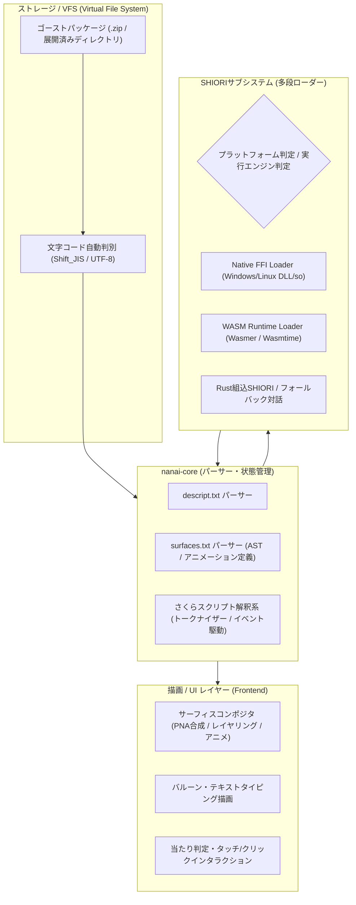

# 2. アーキテクチャと互換レイヤー構成

```mermaid
graph TB
    subgraph StorageLayer["ストレージ / VFS (Virtual File System)"]
        GhostDir["ゴーストパッケージ (.zip / 展開済みディレクトリ)"]
        CharsetDetector["文字コード自動判別 (Shift_JIS / UTF-8)"]
    end

    subgraph CoreParser["nanai-core (パーサー・状態管理)"]
        DescriptParser["descript.txt パーサー"]
        SurfaceParser["surfaces.txt パーサー (AST / アニメーション定義)"]
        SakuraScriptInterpreter["さくらスクリプト解釈系 (トークナイザー / イベント駆動)"]
    end

    subgraph ShioriSubsystem["SHIORIサブシステム (多段ローダー)"]
        ShioriRouter{"プラットフォーム判定 / 実行エンジン判定"}
        NativeLoader["Native FFI Loader (Windows/Linux DLL/so)"]
        WasmLoader["WASM Runtime Loader (Wasmer / Wasmtime)"]
        BuiltinEngine["Rust組込SHIORI / フォールバック対話"]
    end

    subgraph PresentationLayer["描画 / UI レイヤー (Frontend)"]
        SurfaceCompositor["サーフィスコンポジタ (PNA合成 / レイヤリング / アニメ)"]
        BalloonRenderer["バルーン・テキストタイピング描画"]
        CollisionManager["当たり判定・タッチ/クリックインタラクション"]
    end

    GhostDir --> CharsetDetector
    CharsetDetector --> CoreParser
    CoreParser --> ShioriSubsystem
    CoreParser --> PresentationLayer
    ShioriSubsystem --> CoreParser
```

---
