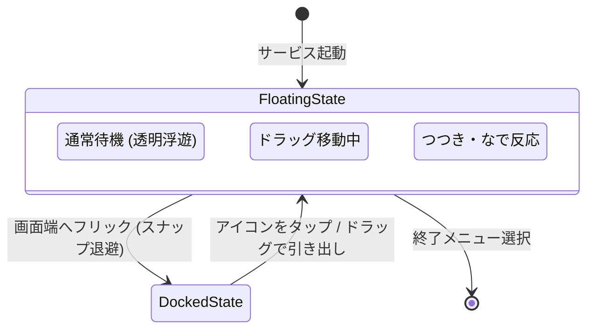

# 5. モバイル専用ジェスチャーと状態遷移

```mermaid
stateDiagram-v2
    [*] --> FloatingState: サービス起動

    state FloatingState {
        Normal: 通常待機 (透明浮遊)
        Dragging: ドラッグ移動中
        Touching: つつき・なで反応
    }

    FloatingState --> DockedState: 画面端へフリック (スナップ退避)
    DockedState --> FloatingState: アイコンをタップ / ドラッグで引き出し
    
    FloatingState --> [*]: 終了メニュー選択
```

### 5.1 画面端スナップ（Docked State）

- ホーム画面操作やゲームプレイの邪魔にならないよう、マスコットを画面左端／右端にフリックすると、**半透明の小さなタブアイコン（幅 24px 程度）** に折りたたまれる仕様。
- タブをタップすることで、元のサイズ・位置にスムーズに復帰。
