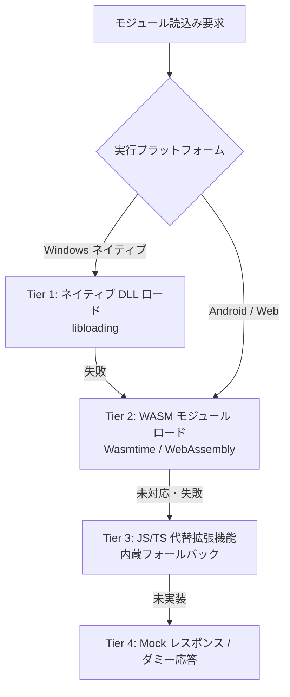

## 2. 読込みアーキテクチャの全体像（フォールバック階層）

本システムは、実行環境（Windows / Android / Web）を自動判定し、以下の優先順位でモジュールをロード・代替実行します。

```mermaid
flowchart TD
    A[モジュール読込み要求] --> B{実行プラットフォーム}
    
    B -->|Windows ネイティブ| C[Tier 1: ネイティブ DLL ロード<br>libloading]
    C -->|失敗| D[Tier 2: WASM モジュール ロード<br>Wasmtime / WebAssembly]
    
    B -->|Android / Web| D
    D -->|未対応・失敗| E[Tier 3: JS/TS 代替拡張機能<br>内蔵フォールバック]
    
    E -->|未実装| F[Tier 4: Mock レスポンス / ダミー応答]
```

---
