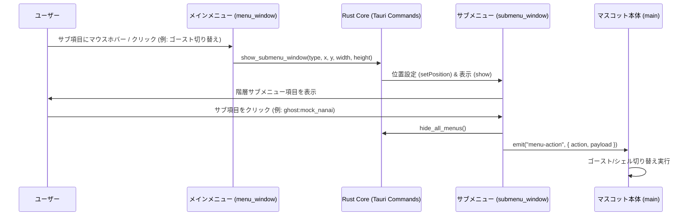

# 2. アーキテクチャとデータフロー

```mermaid
sequenceDiagram
    participant User as ユーザー
    participant MainMenu as メインメニュー (menu_window)
    participant RustCore as Rust Core (Tauri Commands)
    participant SubmenuWin as サブメニュー (submenu_window)
    participant MascotApp as マスコット本体 (main)

    User->>MainMenu: サブ項目にマウスホバー / クリック (例: ゴースト切り替え)
    MainMenu->>RustCore: show_submenu_window(type, x, y, width, height)
    RustCore->>SubmenuWin: 位置設定 (setPosition) & 表示 (show)
    SubmenuWin->>User: 階層サブメニュー項目を表示
    User->>SubmenuWin: サブ項目をクリック (例: ghost:mock_nanai)
    SubmenuWin->>RustCore: hide_all_menus()
    SubmenuWin->>MascotApp: emit("menu-action", { action, payload })
    MascotApp->>MascotApp: ゴースト/シェル切り替え実行
```

---
